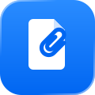

  
  <h1>ClipLocal</h1>
  
<strong>Private Clipboard History for macOS</strong>

  

  Made for  <strong>macOS</strong>
  

  

    
    
    
    
  

  
<em>Your clipboard. Yours alone.</em>

---

**ClipLocal** is a free, privacy-first clipboard history for macOS. It lives quietly in your menu bar, flashes a small **"✓ Copied"** preview in the bottom-right whenever you copy, and keeps a history you can browse, pin, delete, and re-copy.

Built specifically for people who handle **sensitive text** and don't want their clipboard leaving their machine — **100% on-device, no cloud, no accounts, no third parties.**

## 🔒 Why ClipLocal?

| Feature | ClipLocal | Typical Clipboard Apps |
| :--- | :--- | :--- |
| **Privacy** | 🔒 **100% On-Device** (nothing leaves your Mac) | ☁️ Often cloud-synced |
| **Secrets** | 🛡️ **Skips password managers** by default | 😬 Logs everything |
| **Storage** | 💾 **Session-only OR encrypted** (your choice) | 📂 Plain-text on disk |
| **Panic Wipe** | 🧹 **One-click clear** | ⚠️ Buried in menus |
| **Cost** | 🆓 **Free & open** | 💰 Often paid/subscription |

## ✨ Key Features

*   **On-Device Only**: 🔒 Your clipboard data **never** leaves your Mac — no cloud, no servers, no accounts, no analytics, no third parties. Ever.
*   **Two Privacy Modes**: Choose **Session-only** (wiped the moment you quit) or **Persistent** (survives restarts, stored **encrypted** in a protected file only your macOS account can read).
*   **Skips Secrets**: 🛡️ Copies from password managers (marked "concealed") are ignored by default, so passwords never land in your history.
*   **Copy Preview**: 🔔 A subtle "✓ Copied" panel slides into the bottom-right and fades away.
*   **Full Control**: 📌 Pin, delete, and re-copy any item straight from the menu bar.
*   **Quick Shortcuts**: ⌨️ Open the menu and press **⌘1–⌘9** to instantly copy any of your recent items.
*   **Smart Icons**: 🏷️ Each item shows a relevant icon — links, emails, numbers, notes — so your history is easy to scan.
*   **Panic Wipe**: 🧹 One-click "Clear History Now" clears everything instantly.
*   **Launch at Login**: 🚀 Optional — start ClipLocal automatically when you log in.
*   **Menu-Bar Native**: Runs quietly with no Dock icon. Built with Swift for zero dependencies.

## 📦 Install

Install by running the installer in **Terminal**:

1. **Download** [`install-cliplocal.command`](install-cliplocal.command) (open the file, then click **Download raw file**).
2. Open **Terminal** (`⌘ + Space`, type `Terminal`, press Enter).
3. Type `sh ` — that's **s**, **h**, then a **space**.
4. **Drag** the downloaded `install-cliplocal.command` into the Terminal window (its path fills in automatically).
5. Press **Enter**, follow the prompts, then **drag ClipLocal onto the Applications folder**.

> **First time only:** The installer may ask to install Apple's Command Line Tools (a small, official Apple download). Click **Install**, wait, then continue. This lets your Mac build the app locally — which is why macOS trusts it and never shows a "damaged app" warning.

After installing, look for the **clipboard icon in your menu bar** (top-right).

## ⚙️ How It Works

The installer downloads the app's source and **builds it right on your Mac**. Because it's compiled locally rather than downloaded pre-made, macOS Gatekeeper trusts it — no bypassing scary warnings.

## 🗑️ Uninstall

1. Quit ClipLocal (menu-bar icon → **Quit**).
2. Drag **ClipLocal** from Applications to the Trash.
3. To remove saved data: delete `~/Library/Application Support/ClipLocal`.

## 📦 Tech Stack
*   **Swift** (AppKit)
*   **CryptoKit** (AES-GCM encryption for Persistent mode)
*   **Shell** (Installer & Builder)

## 📄 License
MIT License. Free for personal use.

---

  Made with ❤️ by <a href="mailto:arunthomas04042001@gmail.com">Arun Thomas</a>

